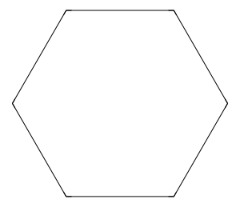
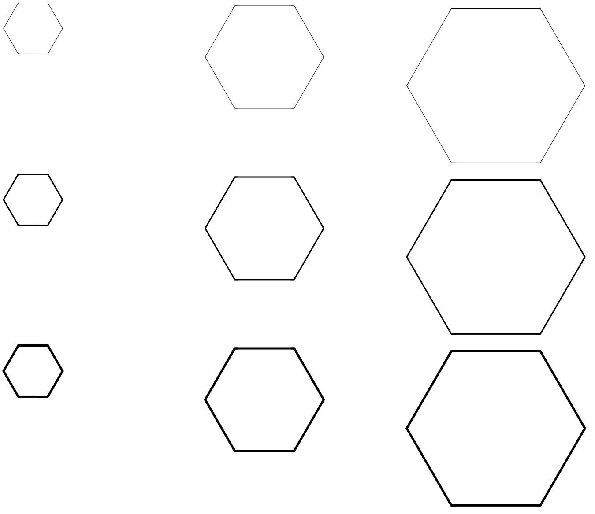
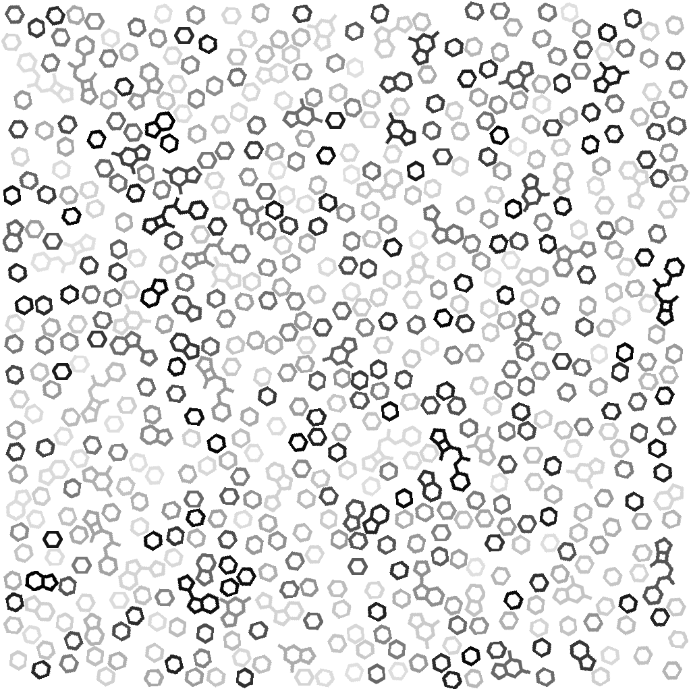
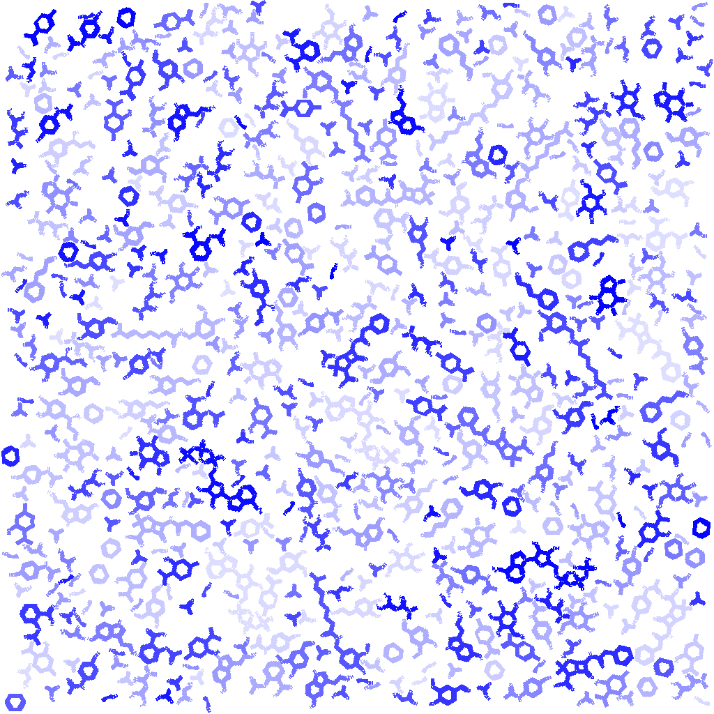

# Chemimg

## Overview  

A very light package that makes Rdkit's molecule drawing simple for quick usage.
It comes with 4 main core attributes.
* With one line of code create a 2D representation of a molecule from its SMILES representation.

* Change the color, size and thickness of the strokes of your molecule. 


* Create a background cover (collage) of a group of molecules by randomly placing and rotating your 2D images.  

* Do all these 3 easily and also for only the molecule scaffolds.


## Installation

This project relies on RDKit and Cairo, which are best installed via conda.

**Cairo must be installed separately.**  
System Requirements (Required for CairoSVG)  
- **Windows**: Install the [GTK Runtime](https://github.com/tschoonj/GTK-for-Windows-Runtime-Environment-Installer/releases).  
- **macOS**: `brew install cairo`  
- **Linux**: `sudo apt-get install libcairo2`  

### Install from PyPI
```bash
pip install chemimg
```

### With conda

```bash
git clone https://github.com/bsaldivaremc2/chemimg
cd chemimg
conda env create -f environment.yml  
conda activate chemimg310
pip install .
```
**OR**  
```bash
pip install git+https://github.com/bsaldivaremc2/chemimg.git
```

## Usage  
Check [**demo.ipynb**](https://github.com/bsaldivaremc2/chemimg/blob/main/demo.ipynb) for examples.

### Load the package
``` python
import os
import chemimg
```
#### Generate one example of the complete molecule or only the scaffold

border_width: thicker strokes\
increase_factor: default 1, makes the image bigger proportionately\
scaffold_only: only plot the molecule scaffold
``` python
ismiles = "CC(C)Cc1ccc(cc1)C(C)C(=O)O"
fo1 = "imgs/demo.png"
scaffold_only = False
chemimg.chem.scaffolds.draw_transparent_mol(ismiles, fo1,increase_factor=100,scaffold_only=scaffold_only,border_width=1)

fo2 = "imgs/demo_scaffold.png"
scaffold_only = True
chemimg.chem.scaffolds.draw_transparent_mol(ismiles, fo2,increase_factor=100,scaffold_only=scaffold_only,border_width=1)

```



``` python
ismiles = "CC(C)Cc1ccc(cc1)C(C)C(=O)O"
border_widths = [1, 3, 5]  # N rows
scales = [50, 100, 150]   # M cols
output_dir = "imgs"

# Molecule grid
prefix = "mol"
mol_grid = chemimg.imgproc.demo.generate_grid(ismiles, output_dir, border_widths, scales, scaffold_only=False, prefix=prefix)
#mol_grid.show() #Open the image in the default image viewer

# Scaffold grid
prefix = "scaffold"
scaffold_grid = chemimg.imgproc.demo.generate_grid(ismiles, output_dir, border_widths, scales, scaffold_only=True, prefix=prefix)
#scaffold_grid.show() #Open the image in the default image viewer

```


### Change colors
``` python
fname = "mol_bw5_scale150.png"
input_path=f"imgs/{fname}"
new_fname = fname.replace(".png","_blue.png")
output_path=f"imgs/{new_fname}"
chemimg.imgproc.colors.change_color_to_color_fast(input_path, output_path, 
                               original_color=(0,0,0), replacement_color=(0,0,255),any_color=False)

nf1 = output_path
new_fname = fname.replace(".png","_allblue.png")
output_path=f"imgs/{new_fname}"
chemimg.imgproc.colors.change_color_to_color_fast(input_path, output_path, 
                               original_color=(0,0,0), replacement_color=(0,0,255),any_color=True)
```


### Make a collage/background cover
for the listed 20 molecules create their 2d representations as:

- Normal molecules  
- Scaffolds only  
- Normal molecules but blue  
- Scaffolds only but red  

``` python
# A collection of 20 diverse SMILES strings 
smiles_list = [
    "CC(=O)Oc1ccccc1C(=O)O",                # Aspirin
    "CC(=O)Nc1ccc(O)cc1",                   # Paracetamol
    "CN1C=NC2=C1C(=O)N(C(=O)N2C)C",         # Caffeine
    "CN(C)C(=N)N=C(N)N",                    # Metformin
    "CC1(C(N2C(S1)C(C2=O)NC(=O)Cc3ccccc3)C(=O)O)C", # Penicillin G
    "CCO",                                  # Ethanol
    "CC(=O)O",                              # Acetic Acid
    "CC(=O)C",                              # Acetone
    "c1ccccc1",                             # Benzene
    "C(C1C(C(C(C(O1)O)O)O)O)O",             # Glucose
    "C1=CC(=C(C=C1CCN)O)O",                 # Dopamine
    "C1=CC2=C(C=C1O)C(=CN2)CCN",            # Serotonin
    "CNC[C@H](C1=CC(=C(C=C1)O)O)O",         # Adrenaline
    "C(C(=O)O)N",                           # Glycine
    "C1=NC(=C2C(=N1)N(C=N2)C3C(C(C(O3)COP(=O)(O)OP(=O)(O)OP(=O)(O)O)O)O)N", # ATP
    "COc1cc(C=O)ccc1O",                     # Vanillin
    "CC1=CCC(CC1)C(=C)C",                   # Limonene
    "C1=CC=C(C=C1)C=CC=O",                  # Cinnamaldehyde
    "CC(C)/C=C/CCCCC(=O)NCC1=CC(=C(C=C1)O)OC", # Capsaicin
    "CC1CCC(C(C1)O)C(C)C"                   # Menthol
]

odir="imgs/imgs4collage/"
for i,ismiles in enumerate(smiles_list):
    ofname = os.path.join(odir,f"mol_{i:03d}.png")
    chemimg.chem.scaffolds.draw_transparent_mol(ismiles, ofname,increase_factor=10,scaffold_only=False,border_width=5,verbose=False)

odir="imgs/imgs4collageScaffold/"
for i,ismiles in enumerate(smiles_list):
    ofname = os.path.join(odir,f"mol_{i:03d}.png")
    chemimg.chem.scaffolds.draw_transparent_mol(ismiles, ofname,increase_factor=10,scaffold_only=True,border_width=5,verbose=False)

# Change colors for collage, to blue for the full molecules, and red for the scaffolds. The any_color=True option will change all non-white pixels to the replacement color, which is useful for images with anti-aliasing or slight variations in color.
input_path="imgs/imgs4collage/"
output_path="imgs/imgs4collageBlue/"
chemimg.imgproc.colors.change_color_to_color_fast(input_path, output_path, 
                               original_color=(0,0,0), replacement_color=(0,0,255),any_color=True)

input_path="imgs/imgs4collageScaffold/"
output_path="imgs/imgs4collageScaffoldRed/"
chemimg.imgproc.colors.change_color_to_color_fast(input_path, output_path, 
                               original_color=(0,0,0), replacement_color=(255,0,0),any_color=True)
```

##### Create 4 collage images

- Normal molecules  
- Scaffolds only  
- Normal molecules but blue  
- Scaffolds only but red  


``` python
folder_paths = ["imgs/imgs4collage/", "imgs/imgs4collageScaffold/", "imgs/imgs4collageBlue/", "imgs/imgs4collageScaffoldRed/"]
output_files = ["imgs/collage_simple.png", "imgs/collage_scaffold.png", "imgs/collage_simple_blue.png", "imgs/collage_scaffold_red.png"]
for folder_path, output_file in zip(folder_paths, output_files):
    chemimg.imgproc.collage.create_collage_randomNoCollapse(output_size=(1024, 1024), folder_path=folder_path, 
                                                            max_time_seconds=10, max_images=1000,
                       output_file=output_file, min_scale_factor=-1, max_scale_factor=-1,
                       lower_alpha=0.5, upper_alpha=1.0,rotate_only_if_vertical=False)
```





## License
This project is licensed under the Creative Commons Attribution–NonCommercial 4.0 International License.
