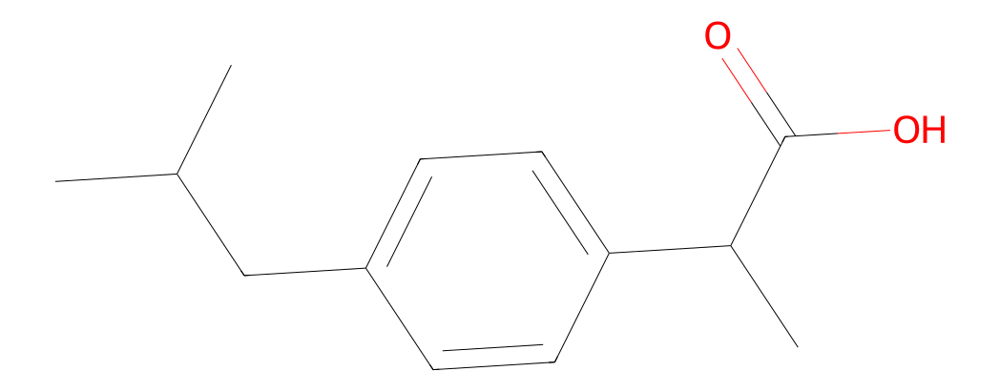
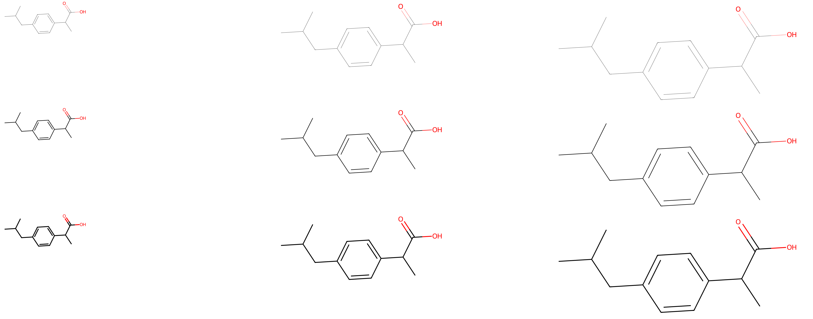
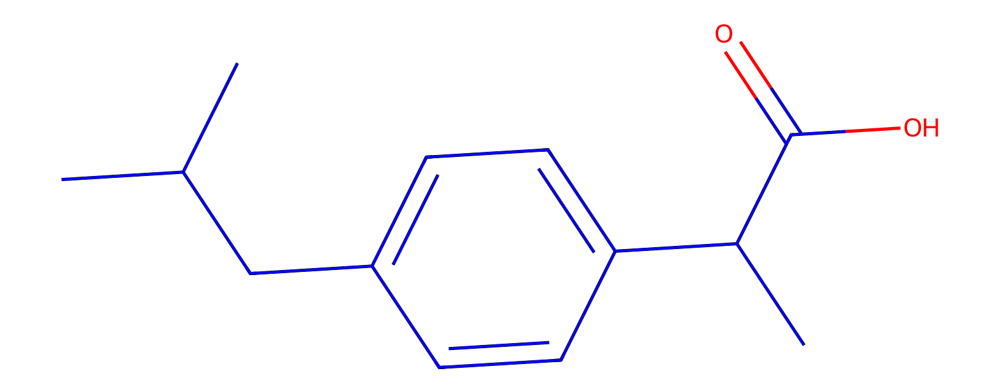
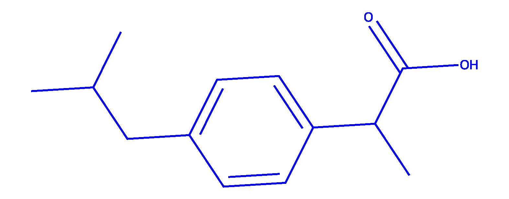
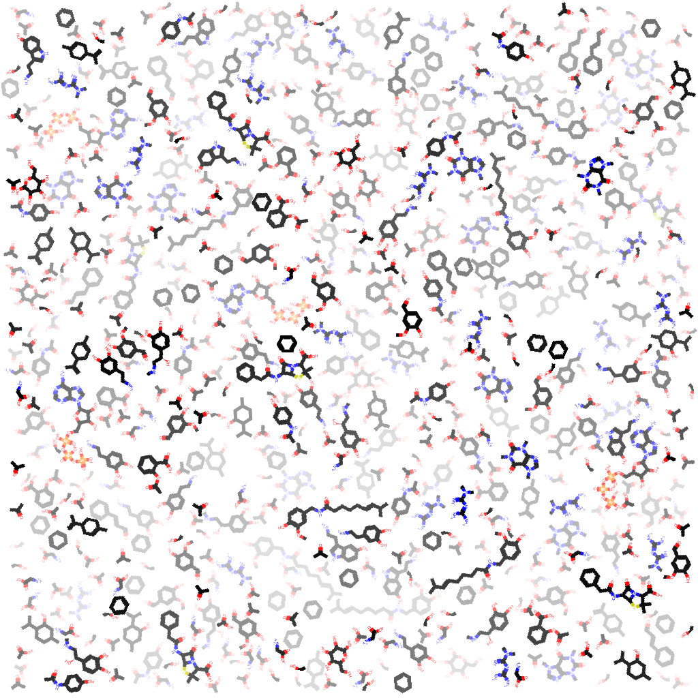
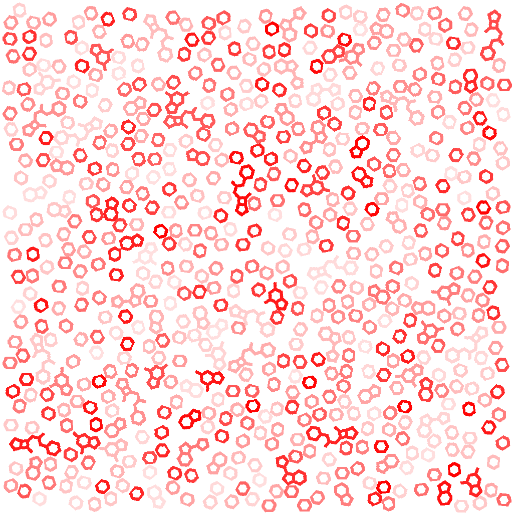

# Chemimg

## Overview  

A very light package that makes Rrkit's molecule drawing simple for quick usage.
It comes with 4 main core attributes.
* With one line of code create a 2D representation of a molecule from its SMILES representation.

* Change the color, size and thickness of the strokes of your molecule. 



* Create a background cover (collage) of a group of molecules by randomly placing and rotating your 2D images.  

* Do all these 3 easily and also for only the molecule scaffolds.


## Installation

This project relies on RDKit and Cairo, which are best installed via conda.

### With conda

```bash
conda env create -f environment.yml  
conda activate chemimg310
pip install .
```
### Other ways   
**Cairo must be installed separately.**  
#### System Requirements (Required for CairoSVG)
- **Windows**: Install the [GTK Runtime](https://github.com/tschoonj/GTK-for-Windows-Runtime-Environment-Installer/releases).  
- **macOS**: `brew install cairo`  
- **Linux**: `sudo apt-get install libcairo2`  

```bash
pip install git+https://github.com/bsaldivaremc2/chemimg.git
```
### Install from PyPI
```bash
pip install chemimg
```

## Usage  
Check **demo.ipynb** for examples.